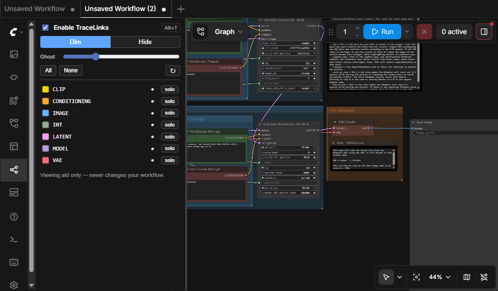
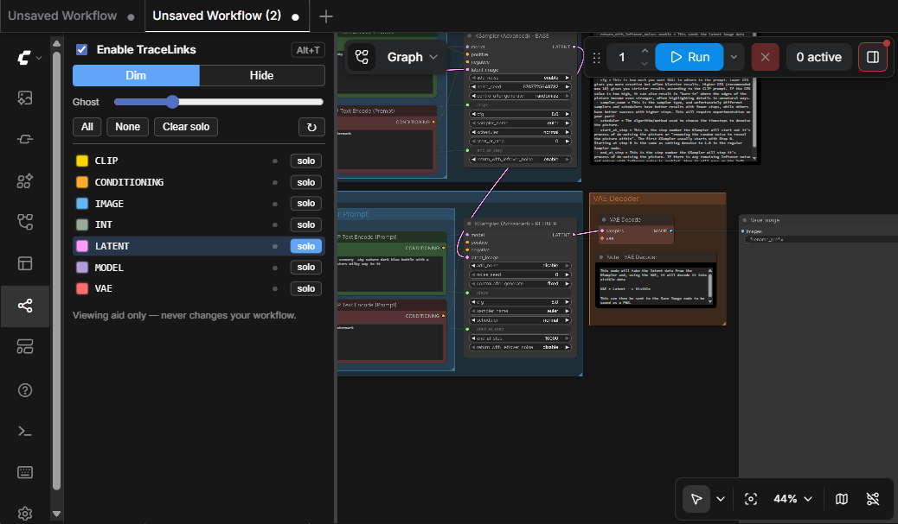
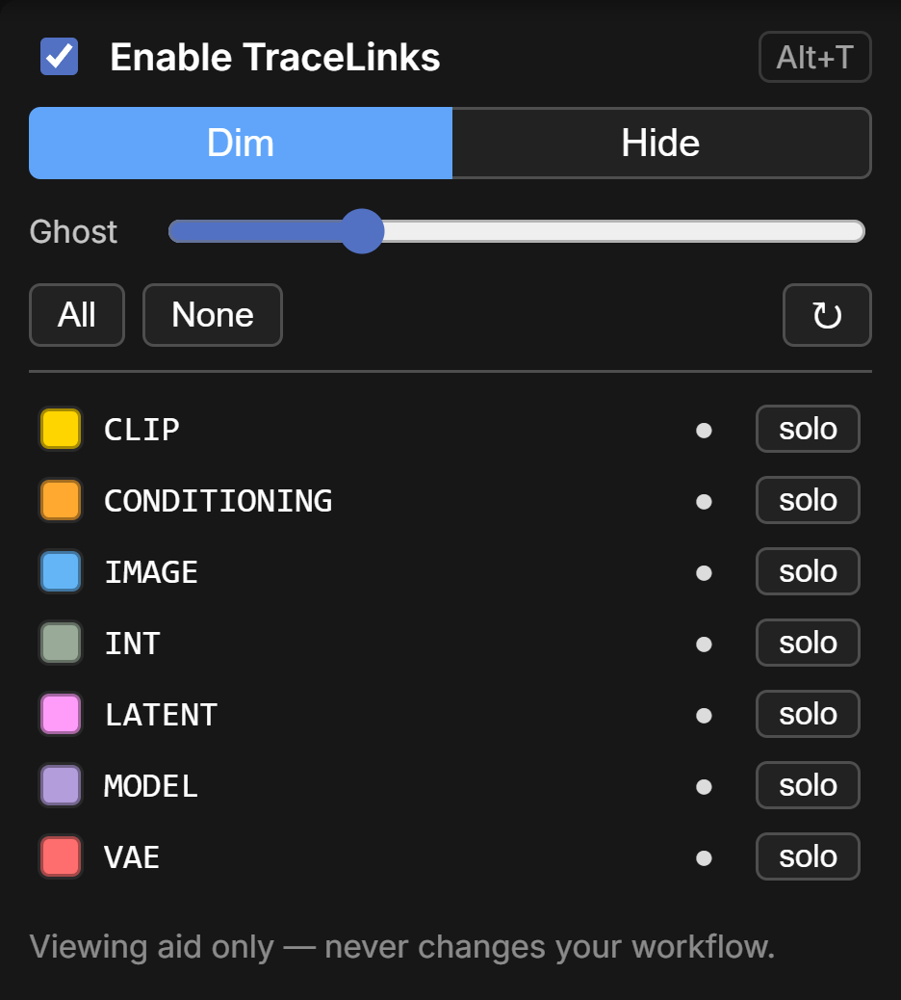
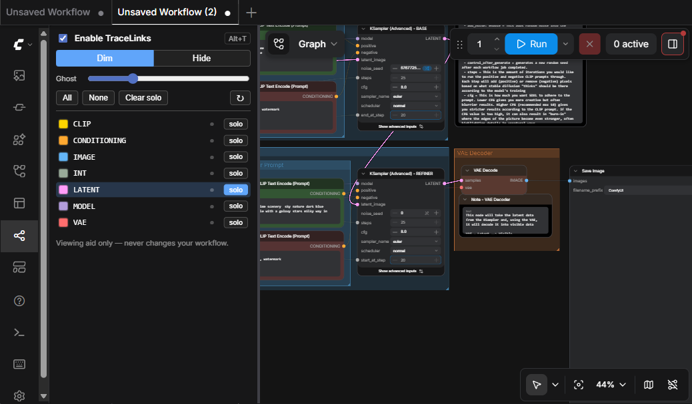

# ComfyUI-TraceLinks

**Trace the spaghetti.** TraceLinks lets you dim or hide node links by their data
type, so you can follow a single path — just the `IMAGE` links, or just `MODEL` — through
a busy ComfyUI workflow.

ComfyUI already colors links by type. TraceLinks turns those colors into filters: mute
everything except the path you care about, and the tangle resolves into something you can
actually read.

It is a **pure viewing aid**. It never changes your graph, your links, execution, or your
saved workflow — it only changes how links are *drawn* on screen, per frame.


*Above: the same workflow with **LATENT** soloed — the generation backbone pops while every
other link fades away.*

### Before / after

| All links (the tangle) | LATENT soloed (traceable) |
| --- | --- |
|  |  |

## Features

- **Per-type toggles** — a sidebar tab lists every link type present in the current
  graph, each with its color swatch. Click the eye to show/hide that type.
- **Solo** — one click isolates a single type and mutes the rest. Click again to release.
- **Dim or Hide** — muted links fade to a faint ghost (default) so you keep spatial
  context, or hide completely for a totally clean trace. Ghost strength is adjustable.
- **Master toggle hotkey** — <kbd>Alt</kbd>+<kbd>T</kbd> flips the whole effect on/off.
- **Works in both render modes** — classic LiteGraph **and** Nodes 2.0 (Vue).
- **Remembers your settings** across reloads (stored locally, never written into the
  workflow file).

## Install

**Via ComfyUI Manager** (recommended): search for **TraceLinks** and install.

**Manual:**
```bash
cd ComfyUI/custom_nodes
git clone https://github.com/EnragedAntelope/ComfyUI-TraceLinks
```
Then restart ComfyUI and refresh the browser. There are no Python dependencies.

## Usage

1. Open the **TraceLinks** tab in the left sidebar (the share/branch icon).

   

2. You'll see a row for every link type in the current graph. From here you can:
   - **Hide a type** — click its eye toggle (●). It fades or disappears.
   - **Isolate a type** — click **solo** on the row you want to trace; everything else
     is muted.
   - **Dim vs Hide** — switch muted links between a faint ghost and fully hidden.
   - **Ghost** slider — tune how faint dimmed links are.
   - **All / None** — show or hide everything at once.
   - **↻** — rescan the graph after loading a new workflow.

3. Press <kbd>Alt</kbd>+<kbd>T</kbd> anytime to toggle the whole effect off and back on
   without leaving the canvas. The hotkey is rebindable in **Settings → Keybindings**
   (command: *Toggle TraceLinks*).

### Dim vs. Hide

Muted links can either **dim** to a faint ghost (default — keeps spatial context so you can
still see where things route) or **hide** completely (maximum clarity). Toggle between them
in the panel; the **Ghost** slider controls how faint dimmed links are.

### Works in both render modes

TraceLinks behaves identically in classic LiteGraph and in **Nodes 2.0** (Vue). Same
workflow, LATENT soloed, running in Nodes 2.0:



## How it works

Both ComfyUI rendering modes still paint connection lines on the LiteGraph canvas, and
both resolve a link's color from its data type. TraceLinks wraps the single link-drawing
function (`LGraphCanvas.prototype.renderLink`) and, before each link is painted, checks
whether its type is currently visible — lowering the canvas alpha (dim) or skipping the
draw (hide) accordingly. That's the entire mechanism, which is why it works identically
in classic and Nodes 2.0 mode.

Because the effect lives entirely inside the draw call, it is impossible for it to alter
the graph or the saved file. If a future ComfyUI ever changes that function, TraceLinks
degrades to a no-op rather than breaking the canvas.

## Compatibility

- ComfyUI with frontend that supports `registerSidebarTab` (current releases).
- Verified in classic LiteGraph and Nodes 2.0 modes.

## License

MIT — see [LICENSE](LICENSE).
